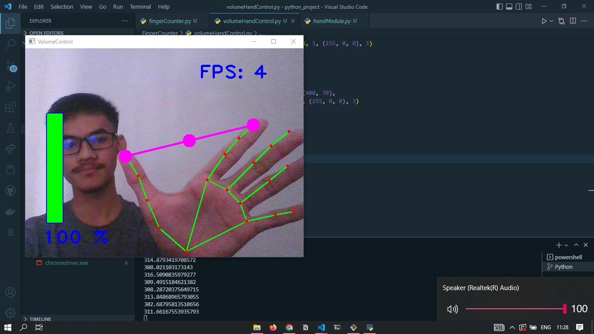
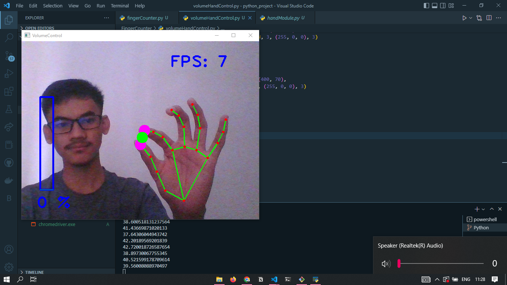

# HandAudioControl

This is a Python project for controlling volume on a PC with hand landmarks. The project uses two main components: `handAudioControll.py` and `handModule.py`.

## Getting Started

These instructions will get you a copy of the project up and running on your local machine for development and testing purposes.

### Prerequisites

The following packages are required to run the project:

- pycaw
- comtypes
- ctypes
- cv2
- numpy
- time
- math
- handModule

### Installing

To install the required packages, use the following command:

```
pip install -r requirements.txt
```

### Usage

To run the project, use the following command:

```
python handAudioControll.py
```

## Functionality

The `handAudioControll.py` script uses the `AudioUtilities` and `IAudioEndpointVolume` modules from `pycaw` to control the audio volume of the default audio endpoint. It also uses the `cv2` and `numpy` packages to perform computer vision operations.

The `handModule.py` script uses the `cv2` and `mediapipe` packages to detect and track hand landmarks. The script returns the positions of the hand landmarks, which are used by the `handAudioControll.py` script to control the volume.

## Example Image

### Full Volume



### Zero Volume



## Contributing

Contributions are welcome and appreciated. To contribute, please create a fork of the repository, make your changes, and submit a pull request.

## License

This project is licensed under the MIT License - see the [LICENSE.md](LICENSE.md) file for details.
